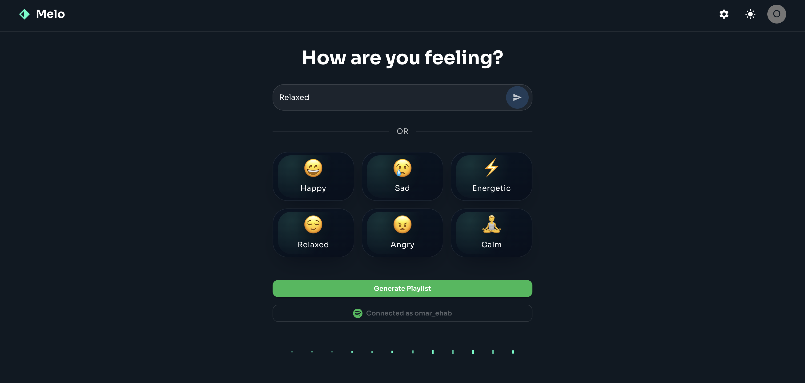
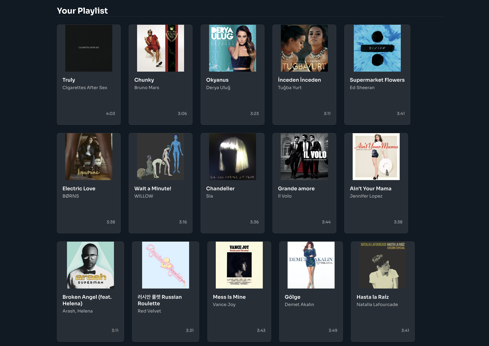

# Melo — Mood → Spotify Playlist  
🎵 A full-stack app that generates Spotify playlists based on your mood using FastAPI and React.

**What it does**
- Turns a short mood description or emoji into a playable Spotify playlist.
- De‑duplicates near‑duplicate tracks (live/remaster/acoustic versions) and avoids repeats per mood across sessions.
- Lets users save the generated playlist to their Spotify account via OAuth.

**Why it helps**
- Makes finding music effortless — based on how you feel, not what you search.
- Produces diverse yet coherent playlists by dynamically adjusting recommendation parameters.
- Reduces noise with smart track de-duplication and normalization.

**Screenshots**
- App home: 
- Generated playlist: 

**Tech highlights**
- OAuth 2.0 (Authorization Code & Refresh Tokens) integration with Spotify API
- Client–server communication via RESTful endpoints using FastAPI
- State persistence with LocalStorage and SQLAlchemy ORM
- Clean, minimal UI built with React + Vite + Material UI + TailwindCSS

**Stack**
- Backend: FastAPI, SQLAlchemy 2.x, httpx/requests, orjson, python-dotenv. OAuth (Authorization Code + refresh tokens) for saving, Client Credentials for recommendations. DB defaults to SQLite; Postgres via `POSTGRES_URL`.
- Frontend: React + Vite, Material UI (MUI), TailwindCSS. Optional voice input via Web Speech API. LocalStorage for theme and per‑mood de‑dupe state.
- Code entry points: `backend/main.py`, `frontend/src/App.jsx`.

**Quickstart**
1) Prerequisites
- Python 3.11+, Node 18+
- Spotify Developer application (Client ID/Secret) with redirect URI set to `http://127.0.0.1:8000/api/auth/callback` (loopback IP required for local dev).

2) Configure environment
- Copy `backend/.env.example` to `backend/.env` and set values:
  - `SPOTIFY_CLIENT_ID` and `SPOTIFY_CLIENT_SECRET`
  - `SPOTIFY_REDIRECT_URI` (keep default for local)
  - `POSTGRES_URL` (defaults to `sqlite:///./melo.db`)
  - `FRONTEND_ORIGIN` (defaults to `http://localhost:5173`)
- Optional: copy `frontend/.env.example` to `frontend/.env` and set `VITE_API_BASE` (defaults to `http://127.0.0.1:8000`).

3) Run backend
```
python -m venv .venv && source .venv/bin/activate
pip install -r backend/requirements.txt
uvicorn backend.main:app --reload --port 8000
```

4) Run frontend
```
cd frontend
npm install
npm run dev
Open http://localhost:5173
```

Core endpoints
- POST `/api/mood-to-playlist` → body `{ mood, emoji, user_id? }` → returns `{ params, tracks[] }`
- POST `/api/save-playlist` → body `{ user_id, name, track_ids[] }` → creates playlist on the user’s Spotify
- GET  `/api/auth/login` → returns an `auth_url` (or redirect with `?redirect=1`)
- GET  `/api/auth/callback?code=...` → exchanges code, upserts user, redirects back with `user_id`

Security & configuration
- Do not commit secrets. `.gitignore` excludes `.env`; use `backend/.env.example` for onboarding.
- If secrets were ever committed, rotate immediately and purge from Git history.
- For production: set `POSTGRES_URL` to PostgreSQL, lock down CORS via `FRONTEND_ORIGIN`, and deploy FastAPI with a process manager/reverse proxy.

**Notes for reviewers**
- The recommendation engine uses multi-batch Spotify API calls with parameter jitter for variety.
- Track canonicalization minimizes duplicates using normalized title + primary artist matching.
- The repo is intentionally lightweight — a FastAPI backend and single-page React frontend for easy review and extension.

---
👨‍💻 Developed by [Omar Ehab Elhefnawy](https://www.linkedin.com/in/omar-ehab-elhefnawy-a904861b8/)  
Backend: FastAPI | Frontend: React | Deployment-ready via Fly.io / Docker
